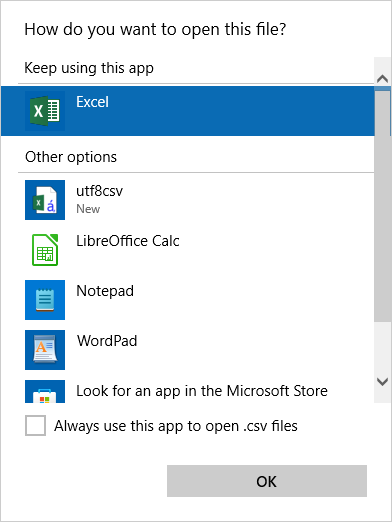
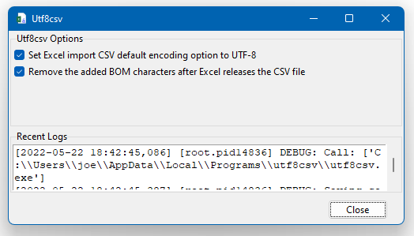

# Installation

Go to "[Releases](https://github.com/indepndnt/utf8csv/releases)" and download the utf8csv-*.msi file from the latest 
release and run it.

The first time you open a CSV file after installation, Windows may ask you to confirm the file association. Select 
"utf8csv" and check "Always use this app to open .csv files".

# Usage

## Opening CSV files

Open a CSV file as usual from within Windows Explorer. (Opening a CSV from within Excel is not supported.)

> As the file handler for CSV files, this program will prepend a 
> "[Byte order mark](https://en.wikipedia.org/wiki/Byte_order_mark)" (BOM) to the CSV file to identify it to Excel as 
> using UTF-8 encoding, which is the most commonly used encoding for CSV files these days. Then it will launch Excel to 
> open the file.

> After Excel releases the file, the program will strip the BOM from the CSV file (as other programs may have issues 
> with the weird extra characters). This behavior is configurable.

## Options

Run "Utf8csv" from your start menu to change options and view runtime logs.

## Importing CSVs within Excel

Not supported: Opening a CSV file from Excel > File > Open.

If you use the legacy "import from text" function in Excel to import a CSV file, you can set the default encoding to 
UTF-8 in this program's options.

> This option sets a value for `DefaultCPG` in the `HKCU\Software\Microsoft\Office\{version}\Excel\Options` registry
> key.

# Uninstall

Uninstall "utf8csv" Windows' "Add or remove programs".

# Development / Contributing

See [Contributing](CONTRIBUTING.md).
