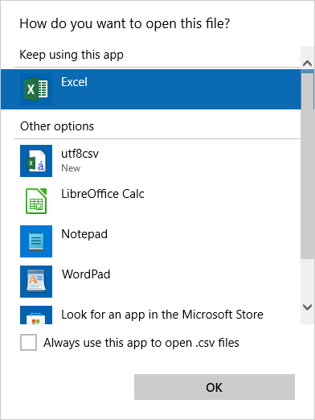
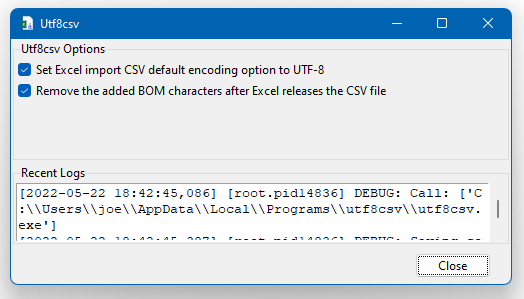

# Installation

Go to "Releases" and download the utf8csv.msi file from the latest release and run it.

On the first run, Windows may ask you to confirm the file association. Select "utf8csv" and check "Always use this 
app to open .csv files".



# Usage

## Loading CSVs

Open a CSV file from within Windows Explorer.

> As the file handler for CSV files, this program will prepend a 
> "[Byte order mark](https://en.wikipedia.org/wiki/Byte_order_mark)" (BOM) to the CSV file to identify it to Excel as 
> using UTF-8 encoding, which is the most commonly used encoding for CSV files these days. Then it will launch Excel to 
> open the file.

> After Excel releases the file, the program will strip the BOM from the CSV file (as other programs may have issues 
> with the weird extra characters).

## Options

Run "Utf8csv" from your start menu to change options and view runtime logs.




## Importing CSVs within Excel

Not supported: Opening a CSV file from Excel > File > Open.

After installation, if you use the legacy "import from text" function in Excel to import a CSV file, it will default 
to UTF-8 encoding.

# Uninstall

Uninstall "utf8csv" Windows' "Add or remove programs".

---

# Development

### Setup
- Clone repository
- Create virtual environment
- `python -m pip install pytest black cx_Freeze -e .`

### Format
```shell
black -l 120 project\utf8csv
```

### Test
```shell
pytest
```

## Build

- set version in `src/utf8csv/version.py`

### Creating Windows installer with cx_Freeze
```shell
# CD to project directory
cd project\utf8csv
# run cx_Freeze
python build.py bdist_msi
```

The output will be a file named like `utf8csv-22.05.22-win64.msi` in a new folder named `dist`.
