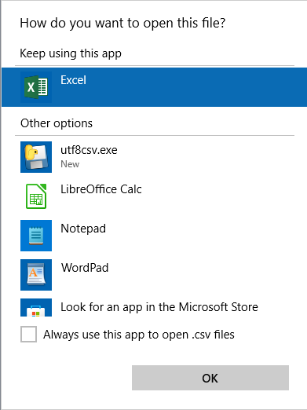

# Installation

Go to "Releases" and download the utf8csv.exe file from the latest release and run it.

> The program will copy itself to %LOCALAPPDIR%\utf8csv.exe and assign itself as the handler for .csv files.

After installing, the next time you open a CSV file, Windows may prompt you with a "How do you want to open this file?" 
window with Excel in the "Keep using this app" section, and utf8csv.exe listed in the "Other options" section. Select 
utf8csv.exe, click the "Always use this app to open .csv files" checkbox and "OK".



# Usage

Open a CSV file from within Windows Explorer.

> As the file handler for CSV files, this program will prepend a 
> "[Byte order mark](https://en.wikipedia.org/wiki/Byte_order_mark)" (BOM) to the CSV file to identify it to Excel as 
> using UTF-8 encoding, which is the most commonly used encoding for CSV files these days. Then it will launch Excel to 
> open the file.

> After Excel releases the file, the program will strip the BOM from the CSV file (as other programs may have issues 
> with the weird extra characters).

Not supported: Opening a CSV file from Excel > File > Open.

After installation, if you use the legacy "import from text" function in Excel to import a CSV file, it will default 
to UTF-8 encoding.

# Uninstall

Run `%LOCALAPPDATA%\utf8csv.exe -u` in the command window.

# Development

### Setup
- Clone repository
- Create virtual environment
- `python -m pip install pytest black pyinstaller -e .`

### Format
```shell
black -l 120 project\utf8csv
```

### Test
```shell
pytest
```

# Build

### Creating .exe file with PyInstaller
```shell
# CD to project directory
cd project\utf8csv
# run PyInstaller
pyinstaller.exe --onefile --noconfirm --ascii --windowed --name utf8csv .\src\utf8csv\main.py
# ... or ...
pyinstaller.exe --onefile utf8csv.spec
```

# Roadmap
- update logging (maybe file rotate)
- add simple tkinter windows for install/uninstall/options/(view logs)
- options: import encoding default on/off
- options: strip bom after close on/off
- create an icon
- need some kind of confirmation after install/uninstall
